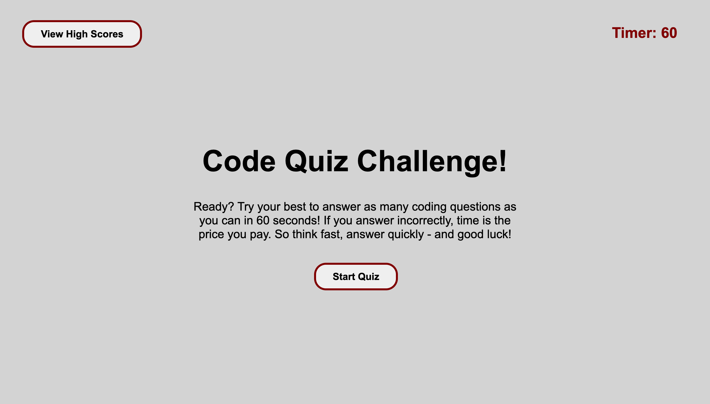
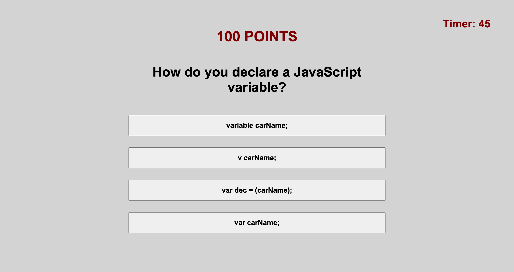
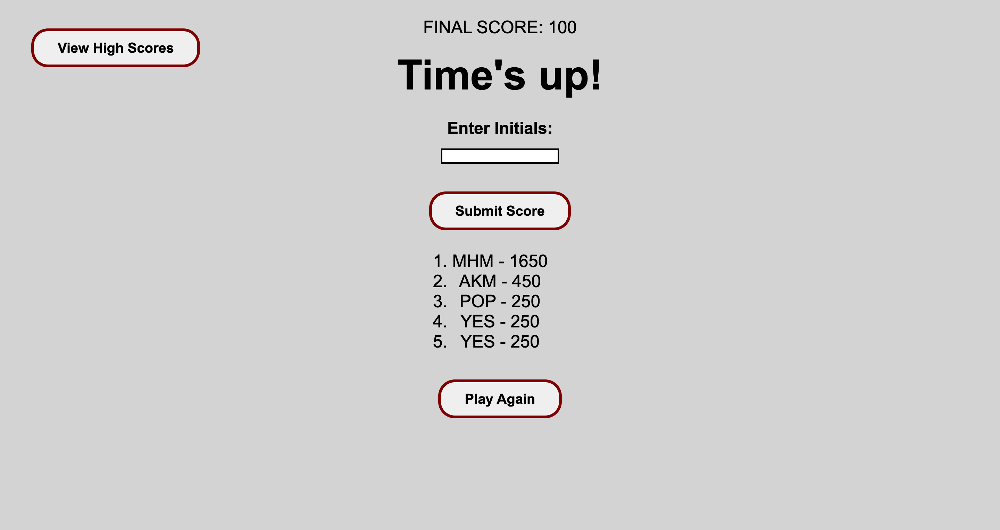
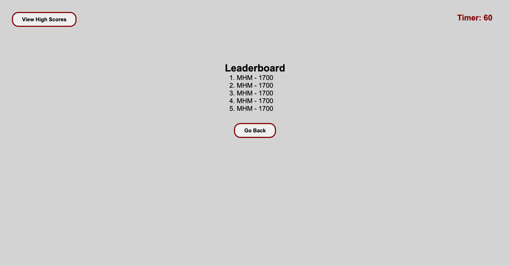

# **Code Quiz Challenge**
***

## Table of Contents
1. [Description](#description)  
2. [Links](#links)  
3. [Visuals](#visuals)  
***

## Description
**Code Quiz Challenge** is a timed coding quiz with multiple-choice questions. This app runs in the browser and features dynamically updated HTML and CSS powered by JavaScript code that I have written. It has a clean, polished, and responsive user interface. Simple, and effective.

Built mainly for the advancing coding boot camp student, this fun and educational quiz is rooted in HTML, CSS, and JavaScript fundamentals and stores high scores so that the user can gauge their progress compared to their peers.

When they click the start button, a timer starts and they are presented with a question. Once the initial question has been answered, they are presented with another question. If the question is answered incorrectly, time is subtracted from the clock. When all questions are answered or the timer reaches 0 - the game is over. They then have the opportunity to save their initials and their score. 

***

## Links
[Link to Code Quiz](https://mattholtmoore.github.io/code-quiz-project/)

[Link to GitHub.com](https://github.com/mattholtmoore/code-quiz-project)  
***

## Visuals

 